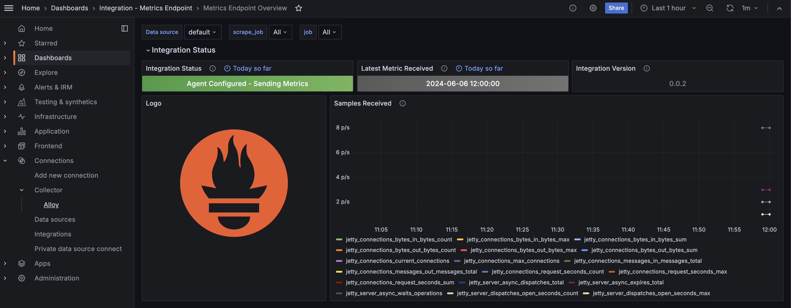

# Javalin Micrometer Example

Ejemplo de proyecto con un simple recolector de métricas de Micrometer configurado para una app en Javalin.

El ejemplo muestra una config mínima para tener:
1) Métricas de la JVM y otros recuros de la instancia local
2) Métricas custom, configurables desde la app y en relación al dominio específico u otro motivo
3) Tags comunes a las métricas para identificar la instancia/servicio/etc particular
4) Exposición del endpoint de métricas utlizando la API propia de Micrometer

## Ejecutar y testear el comportamiento localmente

Para levantar el servicio de ejemplo:

```bash
mvn clean package exec:java
```

Para llamar al servicio con la ruta de métricas:

```bash
curl localhost:7070/metrics -H "Authorization: Bearer token" # cambiar el token por el valor configurado
```

## Integración con Grafana Cloud

Esta sección es un resumen de la configuración [que pueden encontrar aquí, ver para más detalle](https://grafana.com/docs/grafana-cloud/monitor-infrastructure/integrations/integration-reference/integration-metrics-endpoint/).

1) Entrar a Grafana Cloud, crear un usuario y una cloud propia
2) Ir a _Connections_ en la barra izquierda y buscar _Metrics Endpoint_ en la barra de búsqueda para agregar nuevas conexiones


3) Click en _Add new scrape job_ e ir a la configuración del trabajo
4) Configurar el trabajoo de scraping:
    - Nombre del trabajo con el valor que quieran
    - _Scrape job URL_ que debe apuntar al endpoint de métricas de su servicio (ej: https://miservicio.com/metrics)
    - _Type of Authentication Credentials_ en _Bearer_
    - _Bearer Token_ con el valor configurado del token en su app (en este ejemplo por defecto está en `token`)


5) Click en _Test Connection_, _Save Scrape Job_ e _Install_
6) Crear el dashboard

Listo, en el nuevo dashboard creado deberían ver las métricas reportadas por el job de scraping. Pueden configurar este dashboard y customizarlo como prefieran.



El dashboard creado es customizable y podemos agregar todos los paneles (vistas de Grafana) que querramos.

### Creación de un panel

1) Para crear un panel, debemos ir al dashboard deseado.
2) Luego, hace click en _Add_ > _Visualization_ en la barra superior derecha del dashboard 


_Nota:_ si no existe la opción, primero deberá clickear sobre el engranaje de _Dashboard settings_ ya que el dashboard debe estar en modo de sólo lectura

3) Al entrar en la herramienta de creación de paneles, elegir las métricas deseadas (ej: jvm_memory_max_bytes)
4) Click sobre _Run queries_ para empezar a visualizar la data de las métricas seleccionadas
5) Configurar en la barra derecha las opciones de visualización y descripción del panel
6) Click en _Save_ y _Apply_ en la barra superior derecha para salir del modo de edición y volver al dashboard con el nuevo panel agregado

Este nuevo panel se puede cambiar de tamaño, posición y otros atributos. Libre para explorar y dependiendo la necesidad y uso que quieran darle al dashboard.

### Importar un panel desde JSON

En este repositorio pueden encontrar paneles para la memoria de la JVM y la métrica de aplicación que creamos. Ambos paneles se encuentran en formato JSON dentro del directorio de `/panels` y pueden ser usados para importar como se explica a continuación.

Para importar un panel desde un JSON es posible hacer lo siguiente:
1) Crear un panel vacío y volver al dashboard
2) Click sobre el _menu_ del panel > _Inspect_ > _Panel JSON_


3) Borrar el contenido actual del panel y reemplazarlo por el JSON de un panel conocido

_Nota:_ Antes de hacer esto, ceriorarse que tenemos todas las métricas del panel a importar disponibles en nuestro ambiente de Grafana y que cuentan con los mimos nombres utilizados


